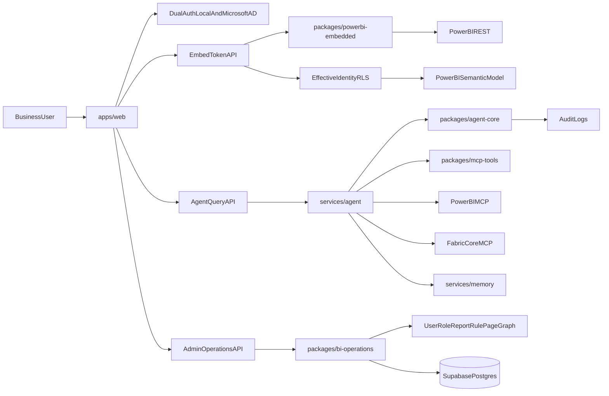

# Architecture Overview

## Target system

## Key contracts

- App-owns-data embedding with service principal and per-request embed token.
- Authentication supports local username/password and Microsoft AD OIDC SSO, unified into the `portal_session` cookie.
- App-level RBAC/ABAC controls every tool invocation and token mint action.
- Admin access is role-based (`portal-admin`) and no longer depends on `x-admin-api-key`.
- Effective identity roles map from portal roles to semantic model RLS roles.
- Tool layer is adapter-based to support MCP preview churn and REST fallback.
- Legacy BI administration strengths are preserved through `packages/bi-operations` and exposed via `/api/admin/*` routes.
- Report/page/rule permissions and favorite workflows are now first-class enterprise operations in the new portal.
- Normalized persistence uses `bi_ops_*` tables for operational metadata and `portal_*` tables for auth/governance state.
- Power BI content sync includes diagnostics for OAuth/workspace/report/pages access and does not fail a whole sync when report pages return `401/403`.

## Current UI contracts

- `/login` is the DataMind-branded auth entry point.
- `/` routes authenticated users to `/t/[tenantSlug]/dashboard` and unauthenticated users to `/login`.
- Tenant routes live under `/t/[tenantSlug]/*` and require a matching authenticated tenant session.
- Admin routes live under `/admin/*` and require `portal-admin`.
- Report list/history pages auto-load data on entry; users should not need to press `Load` before seeing existing data.
