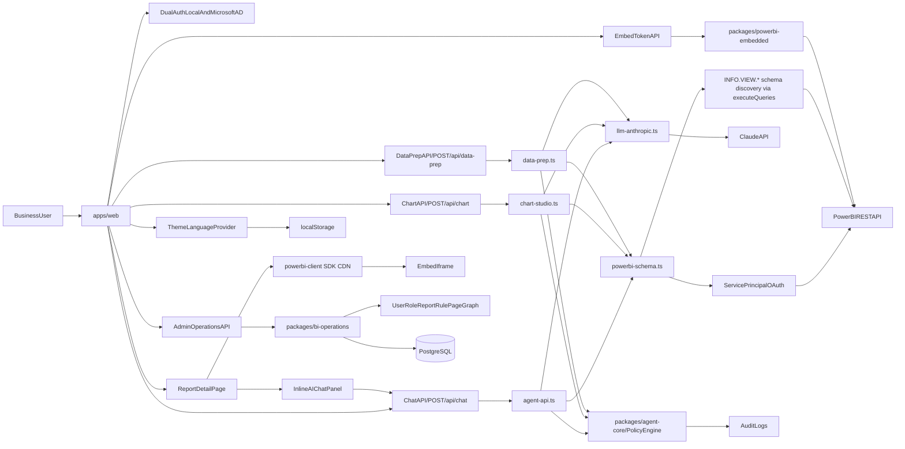

# Architecture Overview

## Target system

## Key contracts

- App-owns-data embedding: service principal OAuth → embed token → `powerbi-client` JS SDK injects token into iframe via postMessage. A plain `<iframe src>` does NOT work — SDK is mandatory.
- Embed token: `tokenType: 1` (Embed). `identities` must be **absent** (not an empty array) when the dataset has no RLS configured — sending any identity causes Power BI 400 `InvalidRequest`.
- Authentication: local username/password (scrypt hashed) and Microsoft AD OIDC SSO (PKCE), both resolve to a signed HMAC `portal_session` cookie.
- App-level RBAC/ABAC controls every tool invocation and token mint action via `PolicyEngine`.
- Admin access is role-based (`portal-admin`); `x-admin-api-key` is deprecated and must not be reintroduced.
- AI Analyst (`/api/chat`): calls Power BI REST API directly with service principal credentials — no external MCP servers needed. Fast path when `reportContext` is provided: skips tenant enumeration, fetches only the active dataset schema.
- Live schema discovery (`powerbi-schema.ts`): the shared helper resolves the semantic model's real tables/columns/measures by running the DAX `INFO.VIEW.COLUMNS()` / `INFO.VIEW.MEASURES()` functions through `executeQueries`. The DMV-style `INFO.COLUMNS`/`INFO.MEASURES` are **blocked** by `executeQueries`; the `INFO.VIEW.*` variants are real DAX and execute. Falls back to REST `/tables` (Push datasets only) when `INFO.VIEW.*` yields nothing. Hidden objects are kept (date dimensions/keys are often hidden); only the internal `RowNumber` column is dropped. This is what stops the agent from guessing table names like `Date`.
- Power BI error extraction: the `executeQueries` error envelope nests its human-readable message under the key `"pbi.error"` (with a dot, not `pbi_error`); `extractPbiErrorMessage` reads it and keeps the generic code as a suffix so callers can tell an API-gate failure from a DAX name error. A failed DAX query self-corrects with one retry, fed the real error text.
- `powerbi-schema.ts` is the single source of truth for service-principal auth, `executeQueries`, error extraction, and schema discovery, shared by `agent-api.ts`, `chart-studio.ts`, and `data-prep.ts`.
- Chart Studio (`/api/chart` → `chart-studio.ts`) and Data Prep (`/api/data-prep` → `data-prep.ts`) are Anthropic-backed, not rule-based. When a dataset is in scope they fetch the live schema and ground the generated chart spec / transform plan in real columns and measures; both return a `groundedInSchema` flag. With no `ANTHROPIC_API_KEY` they throw a clear config error (no silent mock fallback).
- Inline AI chat: embedded in report view (`/t/[tenantSlug]/reports/[reportId]`), auto-sends `reportContext` (reportId, reportName, workspaceId, datasetId) on every message. The panel has a **Clear** action in its header to reset the conversation.
- Normalized persistence: `bi_ops_*` tables for operational metadata, `portal_*` tables for auth/governance state. `flushBiOpsPersistence()` must be awaited before returning sync responses to avoid race on serverless cold starts.
- Sync write batching: `BiOperationsService.runInBatch()` coalesces the many upserts of one logical operation (e.g. a full sync) into a single snapshot persist. Without it, each upsert rewrites the whole snapshot (TRUNCATE + reinsert 11 tables) — O(N) full rewrites that overrun the 60s function limit and surface as a Vercel 504.
- Sync-run read-after-write: the in-memory service is cached per warm serverless instance and never reloads on its own, so a run written on instance A is invisible to a read on instance B (`run_not_found` 404). The run-detail route calls `reloadBiOperationsService()` on a cache miss before returning 404.
- Power BI content sync: diagnostics endpoint for OAuth/workspace/report/pages access. Does not fail whole sync when report pages return 401/403.
- Theme: dark/light toggle and EN/VI language toggle, both persisted in `localStorage` via `ThemeLanguageProvider`. `data-theme` attribute written to `<html>`; `suppressHydrationWarning` prevents SSR mismatch.

## React embed rendering pattern

The report page uses a two-phase pattern to avoid SDK race conditions:

1. **Phase 1** (`fetchAndEmbed`): async function that fetches report list + embed token, then calls `setEmbedData(...)`.
2. **Phase 2** (`useEffect([embedData])`): fires after React commits DOM with visible container. Calls `getPowerBi()` to lazy-load SDK from CDN, then `pbi.embed(container, config)`.

The container uses `visibility: hidden/visible` (never `display: none`) so the SDK can always measure its dimensions.

## Current UI contracts

- `/login` is the DataMind-branded auth entry point.
- `/` routes authenticated users to `/t/[tenantSlug]/dashboard` and unauthenticated users to `/login`.
- Tenant routes live under `/t/[tenantSlug]/*` and require a matching authenticated tenant session.
- Admin routes live under `/admin/*` and require `portal-admin`.
- Report list/history pages auto-load data on entry; users should not need to press `Load` for existing content.
- Report detail page shows embedded report + "Ask AI 🤖" button after report loads; chat panel opens inline at 360px width and exposes a **Clear** action to reset the conversation.
- `/t/[tenantSlug]/agent` ("Ask DataMind") has a **Data scope** selector populated from `/api/reports`. Choosing a report sends `reportContext` to `/api/chat`, triggering the grounded fast path; "All data" stays the default.
- `/t/[tenantSlug]/chart-studio` has a **Dataset scope** selector and renders the spec structurally (chart-type icon, X/Y axis cards, filters, rationale, grounded/inferred badge) — not raw JSON.
- `/t/[tenantSlug]/data-prep` has a **Dataset** dropdown (derived from synced reports) and renders the plan structurally (summary + numbered transform steps) — not raw JSON.
- Theme/language toggles appear in sidebar and are preserved across page loads via `localStorage`.
