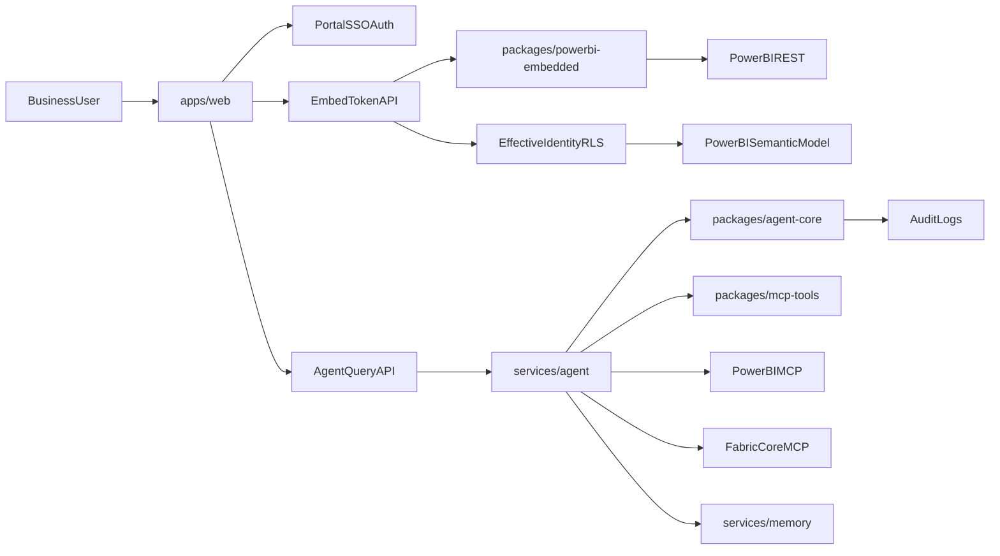

# Architecture Overview

## Target system

## Key contracts

- App-owns-data embedding with service principal and per-request embed token.
- App-level RBAC/ABAC controls every tool invocation and token mint action.
- Effective identity roles map from portal roles to semantic model RLS roles.
- Tool layer is adapter-based to support MCP preview churn and REST fallback.
