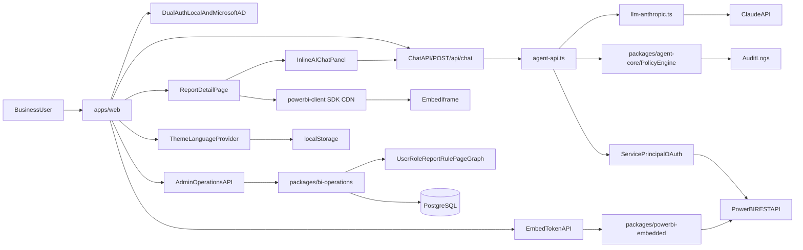

# Architecture Overview

## Target system

## Key contracts

- App-owns-data embedding: service principal OAuth → embed token → `powerbi-client` JS SDK injects token into iframe via postMessage. A plain `<iframe src>` does NOT work — SDK is mandatory.
- Embed token: `tokenType: 1` (Embed). `identities` must be **absent** (not an empty array) when the dataset has no RLS configured — sending any identity causes Power BI 400 `InvalidRequest`.
- Authentication: local username/password (scrypt hashed) and Microsoft AD OIDC SSO (PKCE), both resolve to a signed HMAC `portal_session` cookie.
- App-level RBAC/ABAC controls every tool invocation and token mint action via `PolicyEngine`.
- Admin access is role-based (`portal-admin`); `x-admin-api-key` is deprecated and must not be reintroduced.
- AI Analyst (`/api/chat`): calls Power BI REST API directly with service principal credentials — no external MCP servers needed. Fast path when `reportContext` is provided: skips tenant enumeration, fetches only the active dataset schema.
- Inline AI chat: embedded in report view (`/t/[tenantSlug]/reports/[reportId]`), auto-sends `reportContext` (reportId, reportName, workspaceId, datasetId) on every message.
- Normalized persistence: `bi_ops_*` tables for operational metadata, `portal_*` tables for auth/governance state. `flushBiOpsPersistence()` must be awaited before returning sync responses to avoid race on serverless cold starts.
- Power BI content sync: diagnostics endpoint for OAuth/workspace/report/pages access. Does not fail whole sync when report pages return 401/403.
- Theme: dark/light toggle and EN/VI language toggle, both persisted in `localStorage` via `ThemeLanguageProvider`. `data-theme` attribute written to `<html>`; `suppressHydrationWarning` prevents SSR mismatch.

## React embed rendering pattern

The report page uses a two-phase pattern to avoid SDK race conditions:

1. **Phase 1** (`fetchAndEmbed`): async function that fetches report list + embed token, then calls `setEmbedData(...)`.
2. **Phase 2** (`useEffect([embedData])`): fires after React commits DOM with visible container. Calls `getPowerBi()` to lazy-load SDK from CDN, then `pbi.embed(container, config)`.

The container uses `visibility: hidden/visible` (never `display: none`) so the SDK can always measure its dimensions.

## Current UI contracts

- `/login` is the DataMind-branded auth entry point.
- `/` routes authenticated users to `/t/[tenantSlug]/dashboard` and unauthenticated users to `/login`.
- Tenant routes live under `/t/[tenantSlug]/*` and require a matching authenticated tenant session.
- Admin routes live under `/admin/*` and require `portal-admin`.
- Report list/history pages auto-load data on entry; users should not need to press `Load` for existing content.
- Report detail page shows embedded report + "Ask AI 🤖" button after report loads; chat panel opens inline at 360px width.
- Theme/language toggles appear in sidebar and are preserved across page loads via `localStorage`.
